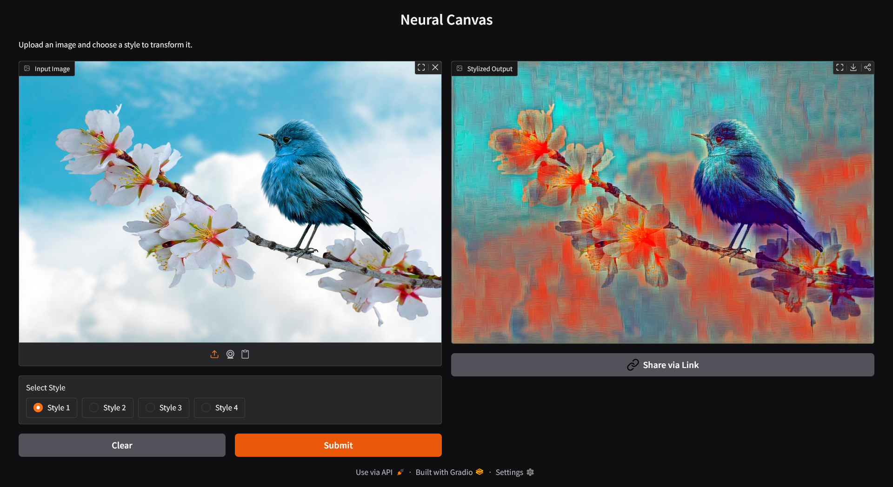

# 🎨 Fast Neural Style Transfer (PyTorch)

A **Fast Neural Style Transfer** implementation in **PyTorch** that generates stylized images in **real time** using a feed-forward neural network trained with **perceptual loss**.

Inspired by *Johnson et al., 2016*, this approach trains a single network per style to perform instant stylization, unlike optimization-based neural style transfer methods.

---

## ✨ Features

- 🚀 Real-time image stylization using a feed-forward CNN  
- 🧠 Perceptual content & style loss using pretrained **VGG-16**  
- 🔁 Residual architecture with **Instance Normalization**  
- 🖼️ Supports training and inference  
- 📦 ONNX export for deployment  
- ⚙️ Clean and modular PyTorch codebase  

---

## 🖼️ Results

Below are example outputs generated by the trained model.

### Example Outputs

  

  

  

Each example shows the transformation of a content image into a stylized output using a single forward pass.

---

## 📉 Training Loss Curve

The plot below shows the perceptual loss trend during training, demonstrating stable convergence.

  

> ⚠️ If this image does not load, rename the file to **extended_loss_plot.png**
> or update the filename here to match exactly.

---

## 🏗️ Model Architecture

The style transfer network is a feed-forward **Transformer Network** composed of convolutional, residual, and upsampling layers.

  

### Architecture Overview

- Initial convolution layers with **Reflection Padding**
- Downsampling using strided convolutions
- **5 Residual Blocks** for feature transformation
- Upsampling via nearest-neighbor interpolation + convolution
- **Instance Normalization** for improved stylization quality

---

## 🧠 Perceptual Loss

Training is guided by **perceptual loss**, computed in feature space using a pretrained **VGG-16** network.

- **Content Loss**  
  Mean Squared Error between content and generated image features  

- **Style Loss**  
  Mean Squared Error between Gram matrices of style and generated image features  

This allows the model to preserve content structure while applying rich artistic styles.

---

## 📚 References

* Johnson, J., Alahi, A., & Fei-Fei, L. *Perceptual Losses for Real-Time Style Transfer and Super-Resolution*, ECCV 2016
* Gatys, L. A., Ecker, A. S., & Bethge, M. *Image Style Transfer Using Convolutional Neural Networks*

---

## 🙌 Author

**Dhruv Garg**
Computer Vision & Deep Learning Enthusiast

---