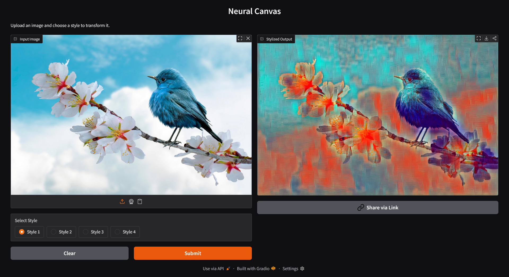
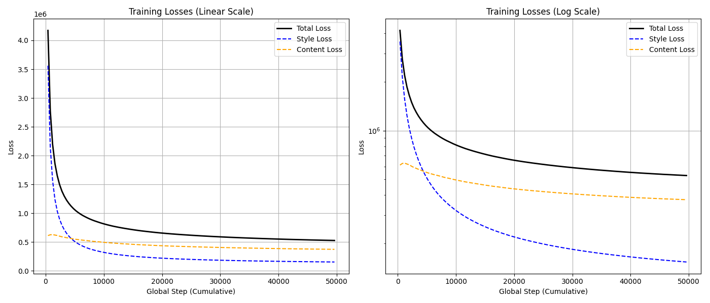

<div align="center">

# 🎨 Neural Canvas

### *Transform Any Image Into Art — Instantly*

[](https://python.org)
[](https://pytorch.org)
[](https://gradio.app)
[](https://huggingface.co/spaces/DhruvGarg111/Style-Transfer)
[](LICENSE)

<br>


<br>

**A real-time neural style transfer application powered by deep learning.**  
*Upload any image. Choose a style. Watch the magic happen.*

[🚀 Try Live Demo](https://huggingface.co/spaces/DhruvGarg111/Style-Transfer) • [📖 How It Works](#-how-it-works) • [🛠️ Installation](#️-installation)

</div>

---

## ✨ Highlights

<table>
<tr>
<td width="50%">

### ⚡ Lightning Fast
Generate stylized images in **real-time** using a feed-forward neural network — no iterative optimization required.

### 🎭 Multiple Styles
Choose from 4 unique artistic styles, each trained on different masterpiece artworks.

### 🌐 Web Interface
Beautiful Gradio-powered interface that runs locally or can be deployed to Hugging Face Spaces.

</td>
<td width="50%">

### 🧠 Perceptual Loss
Trained with state-of-the-art perceptual loss using VGG-16 feature extraction for stunning results.

### 🔧 Clean Architecture
Modular PyTorch codebase with Instance Normalization and Residual Blocks for optimal stylization.

### 📦 Easy Deployment
Export to ONNX for production deployment. GPU accelerated with automatic fallback to CPU.

</td>
</tr>
</table>

---

## 🖼️ Style Gallery

Experience the power of neural style transfer with our pre-trained models:

<div align="center">



<br><br>


</div>

<br>

Each style transforms your images with a single forward pass through our optimized transformer network — capturing the artistic essence while preserving the content structure.

---

## 🧬 How It Works

Our architecture follows the groundbreaking approach of *Johnson et al. (2016)*, using a **feed-forward transformer network** trained with perceptual loss.

<div align="center">

</div>

<br>

### 🏗️ Network Architecture

| Component | Description |
|-----------|-------------|
| **Initial Convolutions** | 3 convolutional layers with reflection padding (9×9, 3×3, 3×3) |
| **Downsampling** | Strided convolutions reduce spatial dimensions by 4× |
| **Residual Blocks** | 5 residual blocks with Instance Normalization for deep feature transformation |
| **Upsampling** | Nearest-neighbor interpolation + convolution to restore resolution |
| **Output Layer** | Final 9×9 convolution producing the stylized RGB image |

### 🧠 Perceptual Loss Function

Training optimizes a combination of **content loss** and **style loss**, computed in the feature space of a pretrained VGG-16:

```
𝓛_total = α × 𝓛_content + β × 𝓛_style
```

| Loss Type | Computation | Purpose |
|-----------|-------------|---------|
| **Content Loss** | MSE between VGG features of content & output | Preserve semantic structure |
| **Style Loss** | MSE between Gram matrices of style & output | Transfer artistic texture |

---

## 📉 Training Convergence

Our models were trained on the MS-COCO dataset, achieving stable convergence as shown below:

<div align="center">

</div>

<br>

The loss curves demonstrate:
- **Rapid initial learning** — steep drop in the first 5,000 steps
- **Stable convergence** — smooth descent without overfitting
- **Balanced optimization** — both content and style losses decrease together

---

## 🛠️ Installation

### Prerequisites

- Python 3.8+
- CUDA-capable GPU (optional, but recommended)

### Setup

```bash
# Clone the repository
git clone https://github.com/DhruvGarg111/Neural-Style-Transfer.git
cd Neural-Style-Transfer

# Install dependencies
pip install -r requirements.txt
```

### Required Files

Download the pre-trained style models and place them in the project root:

| Style | Model File | Description |
|-------|------------|-------------|
| Style 1 | `ckpt_epoch_0_step_12000.pth` | Vibrant impressionist |
| Style 2 | `dark_asthetic_final.pth` | Dark aesthetic |
| Style 3 | `candy_ckpt_epoch_0_step_36400.pth` | Candy colors |
| Style 4 | `mosaic_ckpt_epoch_1_step_74000.pth` | Mosaic pattern |

---

## 🚀 Quick Start

### Launch the Web App

```bash
python app.py
```

The Gradio interface will open in your browser at `http://localhost:7860`

### Usage

1. **Upload** any image
2. **Select** a style from the options
3. **Click Submit** and watch your image transform!

---

## 📁 Project Structure

```
Neural-Style-Transfer/
├── 📄 app.py                 # Gradio web application
├── 📄 transformer_net.py     # Style transfer network architecture
├── 📄 vgg.py                 # VGG-16 for perceptual loss
├── 📄 utils.py               # Image loading & processing utilities
├── 📄 requirements.txt       # Python dependencies
├── 📁 images/                # Example outputs & architecture diagrams
└── 📄 README.md              # This file
```

---

## 🧪 Technical Details

### Transformer Network

```python
TransformerNet(
  (conv1-3)       : ConvLayer with ReflectionPad2d
  (in1-5)         : InstanceNorm2d (affine=True)
  (res1-5)        : ResidualBlock × 5
  (deconv1-3)     : UpsampleConvLayer
)
```

### Key Design Choices

| Choice | Rationale |
|--------|-----------|
| **Instance Normalization** | Better stylization than Batch Norm for single-image inference |
| **Reflection Padding** | Reduces border artifacts compared to zero padding |
| **Residual Connections** | Enables deeper networks without degradation |
| **Nearest-neighbor Upsampling** | Avoids checkerboard artifacts from transposed convolutions |

---

## 📚 References

1. **Johnson, J., Alahi, A., & Fei-Fei, L.** (2016). *Perceptual Losses for Real-Time Style Transfer and Super-Resolution.* ECCV 2016. [arXiv:1603.08155](https://arxiv.org/abs/1603.08155)

2. **Gatys, L. A., Ecker, A. S., & Bethge, M.** (2016). *Image Style Transfer Using Convolutional Neural Networks.* CVPR 2016.

3. **Ulyanov, D., Vedaldi, A., & Lempitsky, V.** (2016). *Instance Normalization: The Missing Ingredient for Fast Stylization.* [arXiv:1607.08022](https://arxiv.org/abs/1607.08022)

---

## 📜 License

This project is licensed under the MIT License — feel free to use, modify, and distribute.

---

<div align="center">

## 👨‍💻 Author

**Dhruv Garg**

*Computer Vision & Deep Learning Enthusiast*

[](https://github.com/DhruvGarg111)

---

<br>

**⭐ If you found this project useful, please consider giving it a star!**

<br>

*Made with ❤️ and PyTorch*

</div>